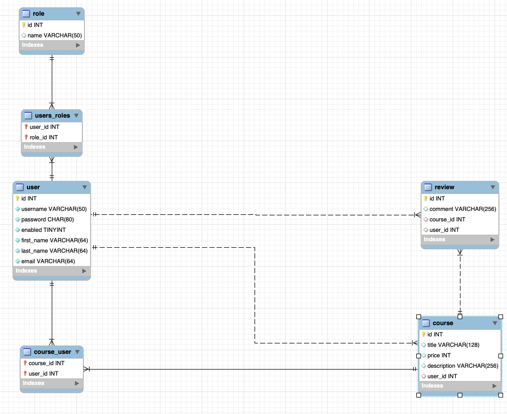

# Learning Service SpringBoot

This program is for RESTful API practice

# Technology

- Spring boot background (3.1.5)
- Spring Security
- Java(1.7)
- JUnit5
- JPA/Hibernate
- MySQL(8.0.22) -> Using [create-schema.sql](https://github.com/percyku/learning-server-springboot/blob/master/create-schema.sql) / [create-tables.sql](https://github.com/percyku/learning-server-springboot/blob/master/create-tables.sql) /[create-users-data.sql](https://github.com/percyku/learning-server-springboot/blob/master/create-users-data.sql) to create schema / tables /users data

  

# Function

- Member Registration -> Role:Instrutor,Student
- Member Login/Logout
- Instrutor Create class
- Studnet Register class
- Studnet Search class

# Unit Test

First thing ,you need to create [create-schema-unit-test.sql](https://github.com/percyku/learning-server-springboot/blob/master/create-schema-unit-test.sql) in MYSQL for unit test,
then you can use spring.jpa.hibernate.ddl-auto=create (fold:/test/resources/application.properties) or [create-tables-unit-test.sql](https://github.com/percyku/learning-server-springboot/blob/master/create-tables-unit-test.sql) to create tables

- Controller
  - UserControllerTest
  - CourseControllerTest
- Service
  - UserServiceTest
  - CourseServiceTest
- Security
  - MySecurityConfigTest

# RESTful API

You can use postman to test those API.

Please follow this [detail](https://github.com/percyku/learning-server-springboot/blob/master/restful-api-operation.md) to operate
