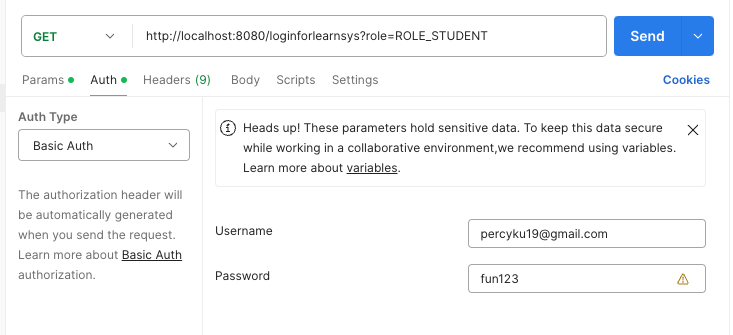
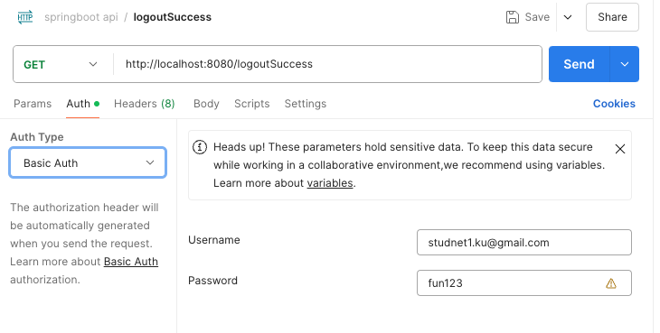

# Learning Service SpringBoot

Ｔ his program is for Restful API practice

# Technology

Spring boot background (3.1.5)
MySQL(8.0.22) -> Using [create-schema.sql](https://github.com/percyku/learning-server-springboot/blob/master/create-schema.sql) / [create-tables.sql](https://github.com/percyku/learning-server-springboot/blob/master/create-tables.sql) to create schema & table
JPA/Hibernate
Spring Security
JUnit5

# Function

Member Registration -> Role:Instrutor,Student

Member Login/Logout

Instrutor Create class

Studnet Register class

Studnet Search class

# Restful API

You can use postman to test below API

Register(roles: ["ROLE_INTRUTOR"]/["ROLE_STUDNET"])

Login (URL Param: role=ROLE_INTRUTOR/ role=ROLE_STUDENT)

Logout

