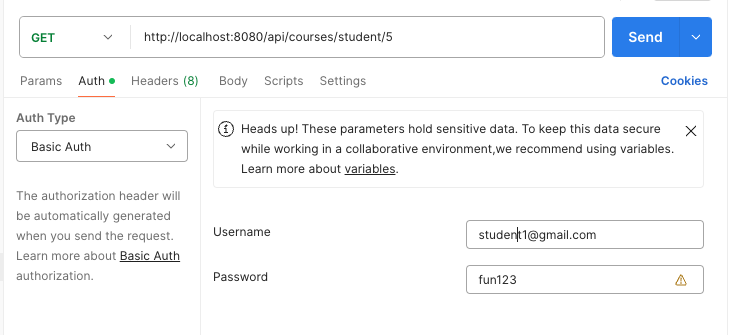

# Learning Service SpringBoot

This program is for RESTful API practice

# Technology

- Spring boot background (3.1.5)
- Spring Security
- Java(1.7)
- JUnit5
- JPA/Hibernate
- MySQL(8.0.22) -> Using [create-schema.sql](https://github.com/percyku/learning-server-springboot/blob/master/create-schema.sql) / [create-tables.sql](https://github.com/percyku/learning-server-springboot/blob/master/create-tables.sql) /[create-users-data.sql](https://github.com/percyku/learning-server-springboot/blob/master/create-users-data.sql) to create schema / tables /users data

  

# Function

- Member Registration -> Role:Instrutor,Student
- Member Login/Logout
- Instrutor Create class
- Studnet Register class
- Studnet Search class

# Unit Test

First thing ,you need to create [create-schema-unit-test.sql](https://github.com/percyku/learning-server-springboot/blob/master/create-schema-unit-test.sql) for unit test,
then you can use spring.jpa.hibernate.ddl-auto=create (fold:/test/resources/application.properties) or [create-tables-unit-test.sql](https://github.com/percyku/learning-server-springboot/blob/master/create-tables-unit-test.sql) to create tables

- Controller
  - UserControllerTest
  - CourseControllerTest
- Service
  - UserServiceTest
  - CourseServiceTest
- Security
  - MySecurityConfigTest

# RESTful API

You can use postman to test below API

- Register(Json body roles: ["ROLE_INTRUTOR"]/["ROLE_STUDNET"])
  
- Login (URL Param: role=ROLE_INTRUTOR/ role=ROLE_STUDENT)
  
- Logout(Please type correct account/password in Basic Auth)
  
- Create Course (Only for Instructor,please type Instructor account/password in Basic Auth )
  
- Enroll Course (Only for student,please type student account/password in Basic Auth / URL Param 14 which is Course ID )
  
- Search create course by Instructor (Only for Instructor,please type Instructor account/password in Basic Auth ,URL Param 8 which is Instructor ID)
  
- Search enroll course by Student (Only for Student,please type Student account/password in Basic Auth ,URL Param 5 which is Student ID )
  
- Search any course by Student (Only for Student,please type Student account/password in Basic Auth )
  
