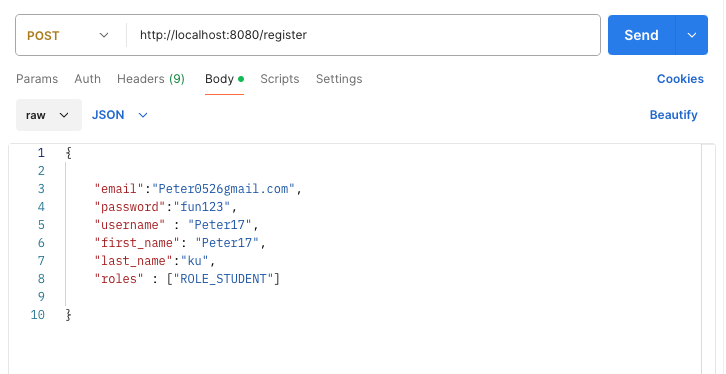
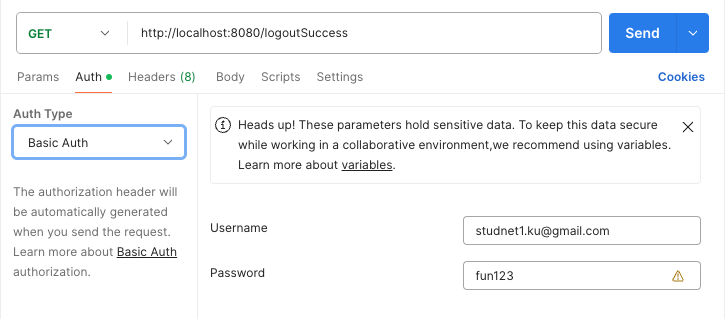
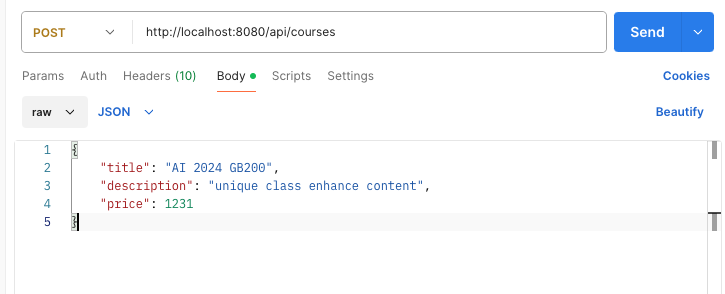
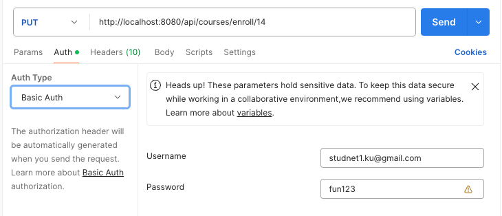
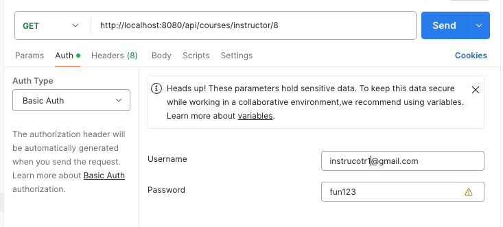
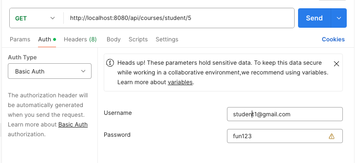
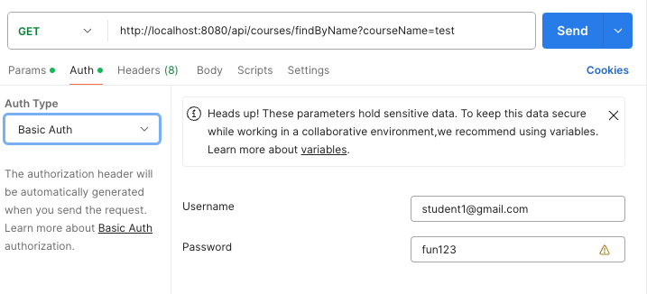

# RESTful API Operation

- Register(Json body roles: ["ROLE_INTRUTOR"]/["ROLE_STUDNET"])
  

- Login (URL Param: role=ROLE_INTRUTOR/ role=ROLE_STUDENT)
  

- Logout(Please type correct account/password in Basic Auth)
  

- Create Course (Only for Instructor,please type Instructor account/password in Basic Auth )
  

- Enroll Course (Only for student,please type student account/password in Basic Auth / URL Param 14 which is Course ID )
  

- Search create course by Instructor (Only for Instructor,please type Instructor account/password in Basic Auth ,URL Param 8 which is Instructor ID)
  

- Search enroll course by Student (Only for Student,please type Student account/password in Basic Auth ,URL Param 5 which is Student ID )
  

- Search any course by Student (Only for Student,please type Student account/password in Basic Auth )
  
